<p align="center">
  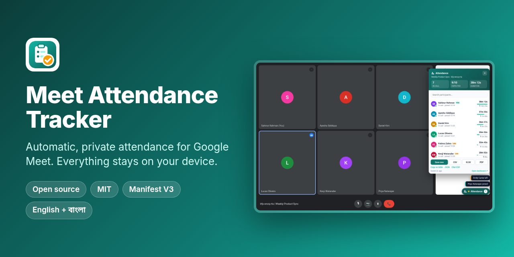
</p>

<p align="center">
  <a href="https://github.com/SahinurDEV/Meet-Attendance-Tracker/actions/workflows/ci.yml"></a>
  <a href="https://github.com/SahinurDEV/Meet-Attendance-Tracker/releases/latest"></a>
  <a href="LICENSE"></a>
  <a href="https://chromewebstore.google.com/detail/meet-attendance-tracker/knhhplmldjejlbhpnhgcbcbnglghoblm"></a>
  
  <a href="CONTRIBUTING.md"></a>
</p>

<p align="center">
  <b>Automatic, private attendance for Google Meet.</b><br>
  A Chrome extension that records who joined your call, when, for how long and how much they spoke. It marks
  your class or team list Present, Late or Absent, and exports a report. No account, no server; nothing
  leaves your device.
</p>

<p align="center">
  <a href="https://chromewebstore.google.com/detail/meet-attendance-tracker/knhhplmldjejlbhpnhgcbcbnglghoblm"><b>⬇️ Install from the Chrome Web Store</b></a>
</p>

<p align="center">
  🌐 <a href="https://sahinurdev.github.io/Meet-Attendance-Tracker/"><b>Website</b></a> ·
  <a href="#install">Install</a> ·
  <a href="#features">Features</a> ·
  <a href="#privacy">Privacy</a> ·
  <a href="#development">Development</a> ·
  <a href="#roadmap">Roadmap</a> ·
  <a href="#contributing">Contributing</a>
</p>

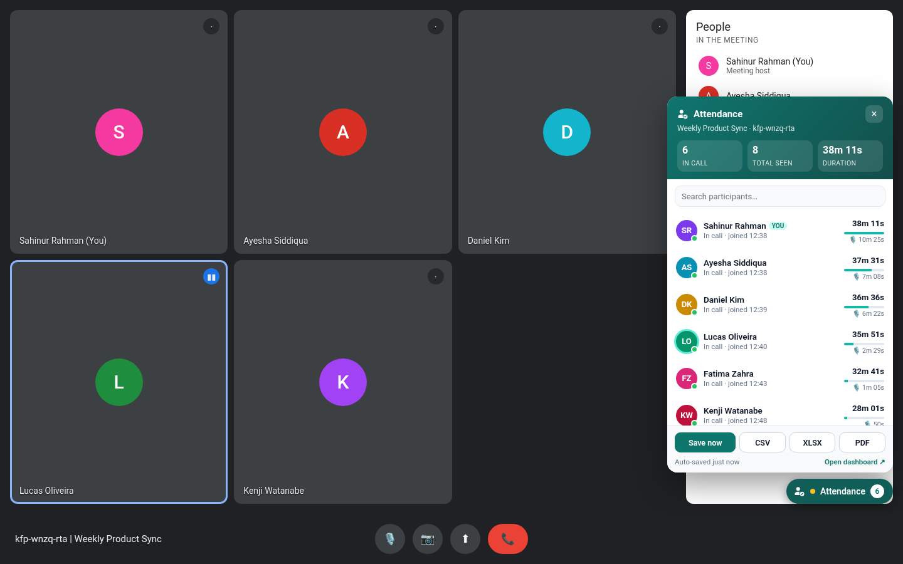

## Highlights

- ⏱️ **Hands-free.** Tracking starts when people appear in the call and saves automatically.
- 📋 **Rosters.** Paste or import your class or team list and see who is Present, Late, Too short or Absent, live in the call.
- 📊 **Dashboard and analytics.** Meeting history, per-person trends, recurring-meeting matrices, tags and notes.
- 📤 **Exports.** CSV, Excel, a branded PDF report (Bengali names render correctly), a mobile-friendly HTML report, JSON or copy as a table.
- 🔒 **Private by design.** Only the `storage` permission. No network requests, no analytics, no audio or video.
- 🌙 **Comfortable.** Dark mode, keyboard shortcuts, English and Bengali (বাংলা).

## Features

### Tracking

| | |
|---|---|
| **Automatic saving** | Tracking starts when participants appear in a call. The list is saved every 15 s (configurable) and again when the call ends. |
| **Manual save** | *Save now* in the in-Meet panel, the popup or with <kbd>Alt</kbd>+<kbd>Shift</kbd>+<kbd>S</kbd>. Turn auto-save off to keep only the meetings you choose. |
| **Per-participant metrics** | **First Seen**, **Last Seen**, **Time in Call** (gaps between sessions excluded), **Speaking Time**, number of **Joins** and a **Status**. |
| **Joins, leaves and rejoins** | Every leave/rejoin is a separate session. A short grace window (10 s by default) smooths over Meet re-rendering tiles so glitches don't count as leaves. |
| **Speaking time** | Estimated from Meet's on-screen speaking indicator, sampled about once a second. No audio is touched. |
| **Chat capture** | Messages shown in Meet's chat panel (sender, time, text) are stored with the meeting and included in exports. Can be turned off. |
| **Join / leave alerts** | Small pop-ups in the Meet panel when someone joins, rejoins or leaves, with an optional quiet sound (WebAudio, no files). |
| **Resilient detection** | Four detection strategies (People panel, `data-participant-id` tiles, `data-self-name` markers, labelled tiles) driven by a `MutationObserver` plus a 1 s poll. Selectors live in one table in `extension/lib/detect.js`. |
| **Reload-safe** | If the Meet tab reloads, the same meeting is resumed instead of starting a duplicate. |

### Rosters and rules

| | |
|---|---|
| **Rosters** | Lists of expected attendees: paste names (one per line, optionally `Name, email`) or import a CSV with a `name` / `first name`+`last name` / `email` / `alias` header. Link a roster to one or more meeting codes, or pick one per meeting. |
| **Flexible matching** | Exact names and aliases, reordered names ("Siddiqua Ayesha"), honorifics ignored ("Md. Rahim Uddin" = "Rahim Uddin") and unambiguous partial names. People not on the roster are marked as guests; you are never a guest. |
| **Present / Late / Too short / Absent** | A configurable **late threshold** (minutes after the start) and a **minimum time in call** (minutes or % of the meeting). Absentees appear in the in-Meet panel ("Not here yet"), the popup, the dashboard and every export. |

### Dashboard

| | |
|---|---|
| **History** | Stats, search (title, code, date, tag or participant), sorting, **tag filter** and absentee counts. |
| **Meeting detail** | Status per person, presence timeline, roster picker, **tags**, **notes**, chat log, rename and delete. |
| **Analytics** | Per-person attendance rate, average time, total speaking and a trend chart; overall charts for attendance over time, top speakers and speaking share. Plain SVG, no chart library. |
| **Recurring meetings** | Meetings with the same code are grouped into a **series** with a who-attended-which-session matrix, exportable to XLSX or CSV. |
| **Settings** | Auto-save and interval, leave delay, chat capture, late and minimum-time rules, notifications and sound, ignore my own name, 12h/24h, **theme** (system / light / dark), shortcut list, JSON backup/restore (now including rosters), delete everything. |

### Exports

| Format | What you get |
|---|---|
| **CSV** | UTF-8 with BOM, RFC 4180 quoting, protected against formula injection. Includes a Status column and absentee rows. |
| **XLSX** | Real Office Open XML: an *Attendance* sheet with meeting info, summary and status-coloured cells, plus a *Chat* sheet. |
| **PDF** | Branded A4 report: logo, meeting info, summary pills (Present, Late, Too short, Absent, attendance %, average time, total speaking, top speaker), roster, tags, notes, status-coloured table and the chat. **Bengali and other non-Latin names render correctly.** |
| **HTML** | A self-contained, **mobile-friendly report** (same content as the PDF): the table becomes cards on phones, it follows dark mode, the text is searchable, and it has no scripts or remote assets. |
| **JSON** | Structured export: meeting, summary, participants with sessions, absentees and chat. |
| **Copy as table** | Tab-separated rows on the clipboard, ready to paste into Google Sheets or Excel. |
| **Chat CSV** | Just the chat: time, sender, message. |
| **Bulk export** | Any date range and/or tag into one XLSX (summary sheet + one sheet per meeting), one combined CSV, or one JSON file. |
| **Series export** | The recurring-meeting matrix as XLSX (status-coloured) or CSV. |

File names include the meeting date, e.g. `meet-attendance_abc-defg-hij_2026-10-09_1400.xlsx`. All encoders (ZIP, XLSX, PDF) are written from scratch and bundled; nothing is loaded from a CDN.

### Everywhere

- **Dark mode** follows your system by default, or force light or dark. Applies to the in-Meet panel, popup and dashboard.
- **Keyboard shortcuts** via `chrome.commands`: <kbd>Alt</kbd>+<kbd>Shift</kbd>+<kbd>M</kbd> toggles the in-Meet panel, <kbd>Alt</kbd>+<kbd>Shift</kbd>+<kbd>S</kbd> saves now. Change them at `chrome://extensions/shortcuts`.
- **Languages:** English and Bengali (বাংলা) through `chrome.i18n` (`extension/_locales`). The UI follows the browser language.

<table>
  <tr>
    <td width="50%">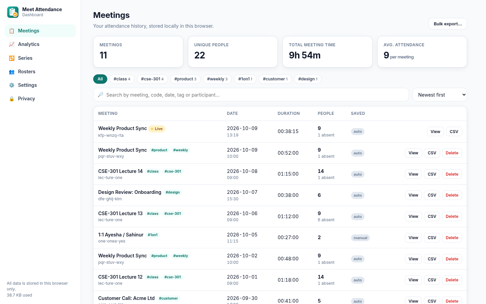</td>
    <td>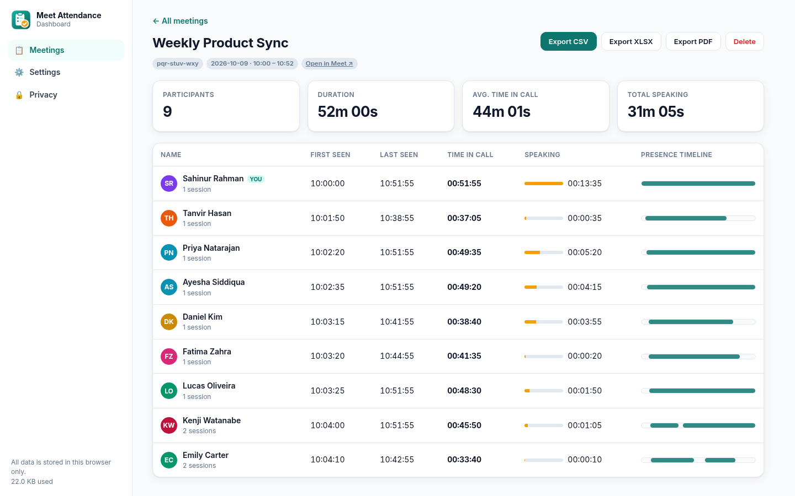</td>
  </tr>
  <tr>
    <td>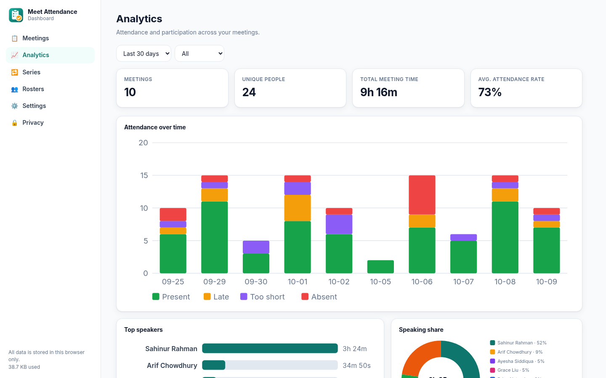</td>
    <td>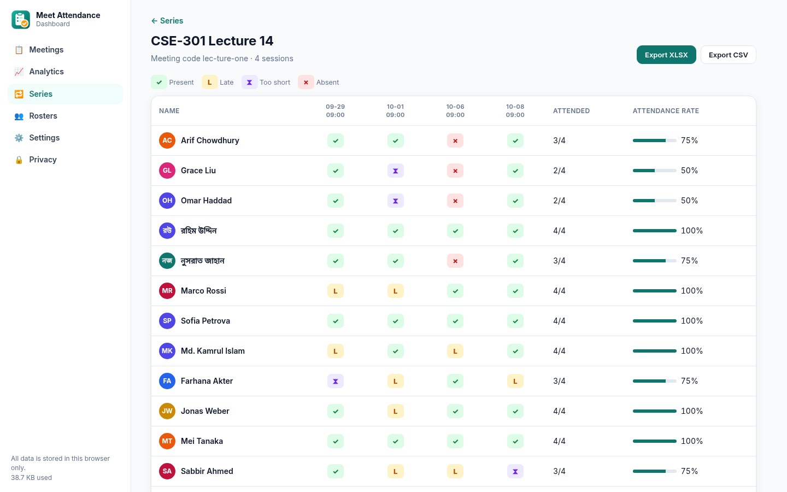</td>
  </tr>
  <tr>
    <td>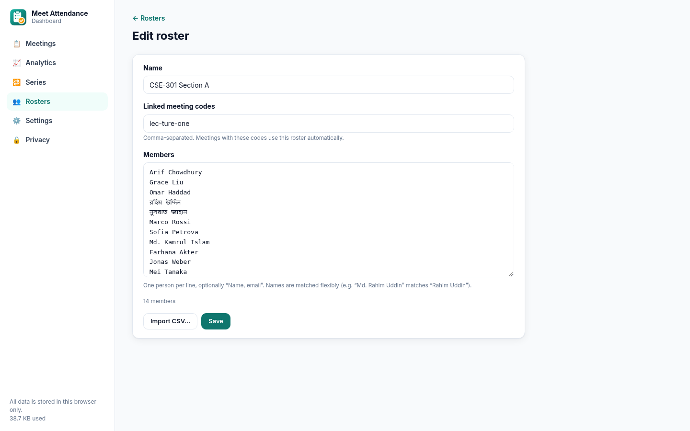</td>
    <td>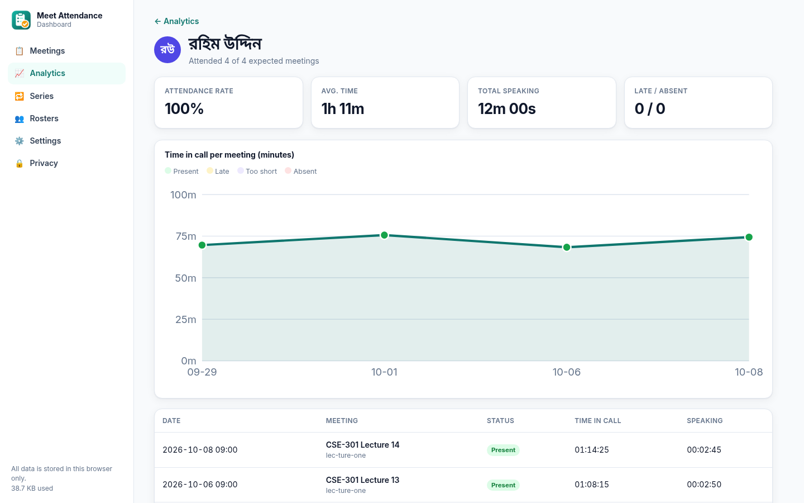</td>
  </tr>
  <tr>
    <td>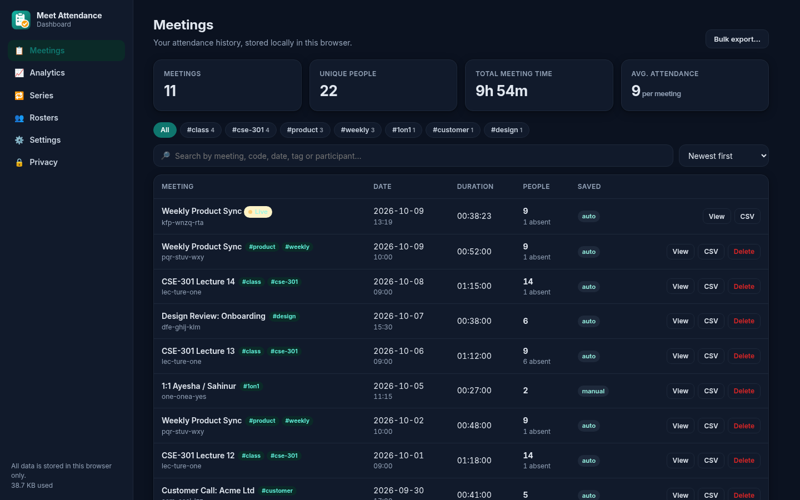</td>
    <td>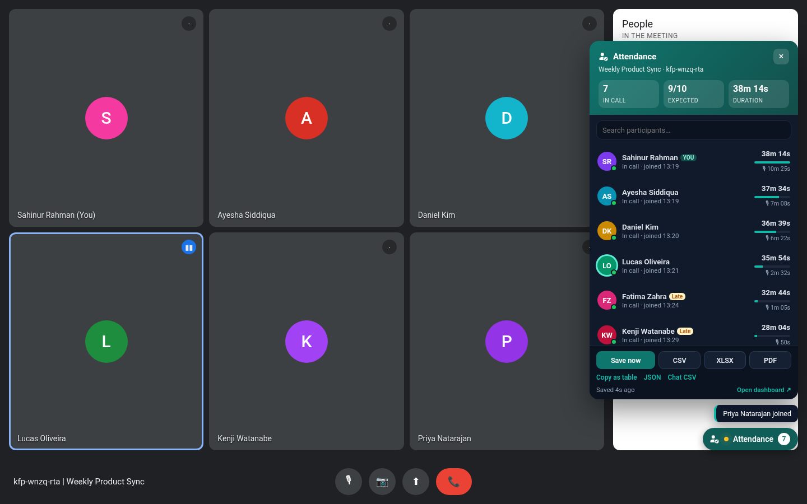</td>
  </tr>
  <tr>
    <td>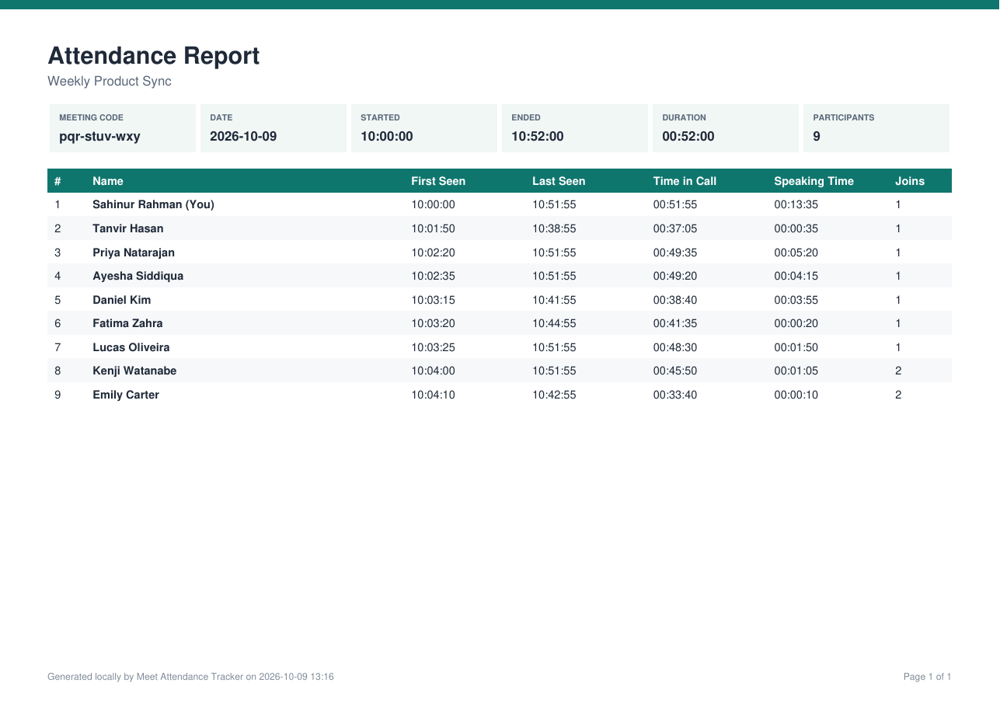</td>
    <td align="center">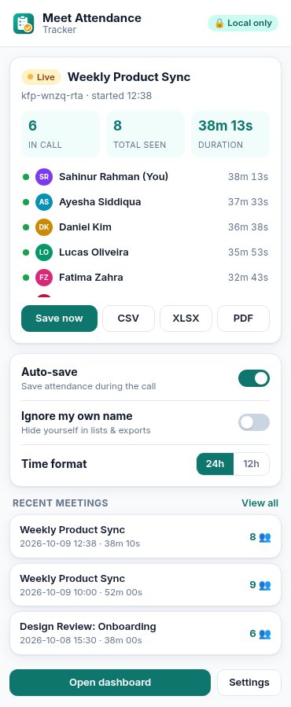</td>
  </tr>
  <tr>
    <td>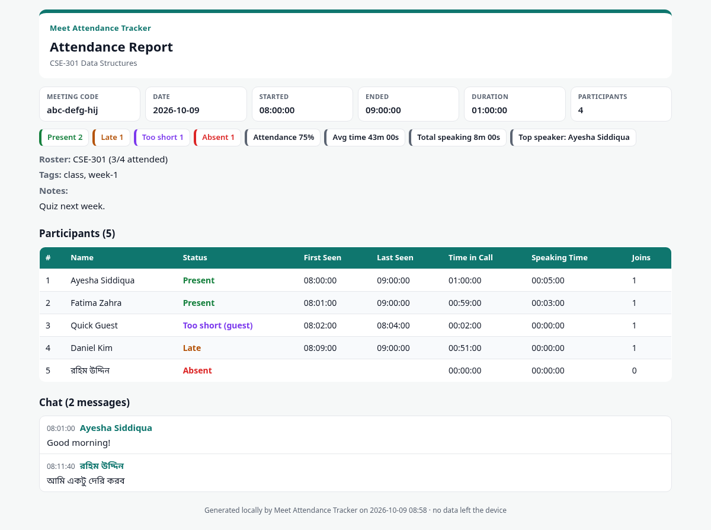</td>
    <td align="center">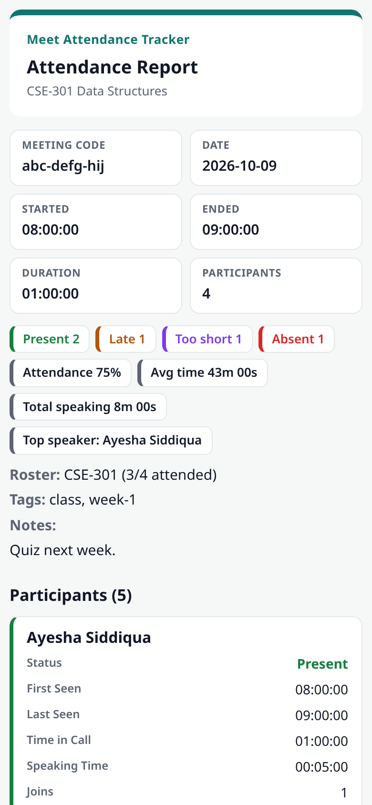</td>
  </tr>
</table>

## Install

### Chrome Web Store (recommended)

**[Add Meet Attendance Tracker to Chrome →](https://chromewebstore.google.com/detail/meet-attendance-tracker/knhhplmldjejlbhpnhgcbcbnglghoblm)**

1. Open the [Chrome Web Store listing](https://chromewebstore.google.com/detail/meet-attendance-tracker/knhhplmldjejlbhpnhgcbcbnglghoblm) and click **Add to Chrome**.
2. Pin *Meet Attendance Tracker* from the puzzle-piece menu.
3. Join a call on `meet.google.com`. Attendance is recorded automatically.

Updates install automatically. This also works in Brave, Opera and other Chromium browsers, and in Edge (see below).

### For developers: from a release zip (load unpacked)

Use this to try a build before it reaches the store, or to test your own changes.

1. Download `meet-attendance-tracker-vX.Y.Z.zip` from the [**latest release**](https://github.com/SahinurDEV/Meet-Attendance-Tracker/releases/latest) and unzip it into a folder.
2. Open `chrome://extensions` (also works in Edge, Brave and other Chromium browsers, v110+).
3. Turn on **Developer mode** (top-right).
4. Click **Load unpacked** and select the unzipped folder (the one that contains `manifest.json`).
5. Pin *Meet Attendance Tracker* from the puzzle-piece menu.

To update, download the new zip, replace the folder's contents and click the reload icon on the extension card.
Your data is kept, because it lives in the browser and not in the folder.

### Microsoft Edge

The easiest way is the [Chrome Web Store listing](https://chromewebstore.google.com/detail/meet-attendance-tracker/knhhplmldjejlbhpnhgcbcbnglghoblm): in Edge, click **Allow extensions from other stores** when prompted, then **Get** / **Add to Chrome**.

The release zip also works in Edge for development (tested with Edge 155; the full integration suite passes in Edge, see `npm run test:edge`):

1. Download and unzip the [latest release](https://github.com/SahinurDEV/Meet-Attendance-Tracker/releases/latest) as above.
2. Open `edge://extensions`.
3. Turn on **Developer mode** (the toggle in the left sidebar; on narrow windows it's under the ☰ menu).
4. Click **Load unpacked** and select the unzipped folder.
5. Click the puzzle-piece (Extensions) button in the toolbar and choose the eye icon (**Show in toolbar**) next to *Meet Attendance Tracker*.
6. Join a call on `meet.google.com` in Edge.

Notes for Edge:
- Change the keyboard shortcuts at `edge://extensions/shortcuts`.
- Edge may show a "Turn off extensions in developer mode" prompt after a restart. Choose **Keep** (or dismiss it) to keep the extension. A store listing for Edge Add-ons is on the roadmap.
- Exports go to Edge's downloads list (Ctrl+J), like any other download.

### Firefox (experimental)

Firefox 140+ is supported through a separate build with a Firefox-specific manifest. The background runs as an event page instead of a service worker, and the manifest adds a Gecko add-on ID. It isn't on addons.mozilla.org yet.

1. Build it: `npm install && npm run package:firefox` → `dist/meet-attendance-tracker-v<version>-firefox.zip`.
2. Open `about:debugging#/runtime/this-firefox`, click **Load Temporary Add-on…** and pick the zip (or `dist/firefox/manifest.json`).
3. Join a call on `meet.google.com`. If Firefox asks, allow the extension to run on that site (*Extensions* menu → *Meet Attendance Tracker*).

Temporary add-ons are removed when Firefox restarts. For a lasting install you need a signed build, which comes with the planned AMO listing.
`npm run lint:firefox` runs Mozilla's `web-ext lint` on the build.

### From source

```bash
git clone https://github.com/SahinurDEV/Meet-Attendance-Tracker.git
```

Then load the **`extension/`** folder with **Load unpacked**. There's no build step: `extension/` is plain
JavaScript, HTML and CSS.

## Usage

1. Join a call on `meet.google.com`. Tracking starts automatically.
2. Click the floating **Attendance** button in Meet (or the toolbar icon) to see the live list, who's missing and join/leave alerts.
3. Press **Save now** (<kbd>Alt</kbd>+<kbd>Shift</kbd>+<kbd>S</kbd>) any time, or let auto-save do it.
4. Export from the panel, or open the **Dashboard** for history, rosters, analytics, series and bulk exports.

**Tips**
- Meet only renders some video tiles in big calls. Keep the **People** panel open for the most complete list.
- Open the **chat** panel at least once during the call if you want the chat saved.
- Create a roster under **Dashboard → Rosters** and link it to your recurring meeting code to see absentees live.

## Privacy

- **Local only.** Attendance, rosters, chat and settings live in `chrome.storage.local` in your browser. Uninstalling the extension removes them.
- **No network.** No servers, accounts, analytics or third-party scripts. A static check (`npm run lint:manifest`) fails the build if extension code uses `fetch`, XHR, WebSockets or remote scripts, and the integration tests assert that no request leaves the device.
- **No audio or video.** Only names, indicators and chat messages that Meet already shows on screen are read.
- **Minimal permissions.** `storage`, plus a content script on `https://meet.google.com/*`. Keyboard shortcuts (`commands`) and `chrome.i18n` need no permission, downloads use `<a download>`, and the clipboard is written from a user click.
- **Your control.** Delete single meetings or everything, or export/import a JSON backup.

Full policy: [Privacy Policy](https://sahinurdev.github.io/Meet-Attendance-Tracker/privacy.html). Please follow your
organisation's policies and local laws when recording attendance.

## Development

Requires **Node.js 20+**.

```bash
npm install
npm run test:setup         # one-time: download Playwright's Chromium
npm run lint               # ESLint
npm run lint:manifest      # MV3, permissions and no-remote-code checks
npm test                   # unit + integration
npm run test:unit          # node:test, no browser
npm run test:integration   # Playwright + Chromium with the unpacked extension
npm run test:edge          # the same integration suite in an installed Microsoft Edge
npm run package            # → dist/meet-attendance-tracker-v<version>.zip
npm run package:firefox    # → dist/meet-attendance-tracker-v<version>-firefox.zip (build:firefox for an unpacked dir)
npm run lint:firefox       # Mozilla web-ext lint on the Firefox build
npm run screenshots        # regenerate docs/screenshots/*.png
npm run icons              # re-render icons from assets/logo.svg
python3 scripts/locales.py # regenerate extension/_locales/*/messages.json (see scripts/locales/README.md)
```

### Tests

**Unit tests** (`test/unit`, 54 tests) cover name normalisation, session merging, join/leave/rejoin and
grace handling, speaking time, resume after reload, chat de-duplication, roster CSV parsing and matching,
late / minimum-time rules, analytics (per person, overview, series matrix), SVG charts, storage (rosters,
user fields surviving auto-saves) and every encoder. XLSX is read back with SheetJS; PDFs are checked
structurally (xref offsets, stream lengths, image XObjects with soft masks, RunLength round trip) and with
`pdftotext`/`pdfimages` when poppler is installed. An i18n test checks that every string used in the code
exists in both locales with matching placeholders, and that the store-facing strings are plain sentences rather than keyword lists.

**Integration tests** (`test/integration`, 13 tests) launch Chromium with the unpacked extension and route
`https://meet.google.com/*` to [`test/fixtures/mock-meet.html`](test/fixtures/mock-meet.html), a
Meet-like page whose participants join, leave, flicker, speak and chat on command. They cover the manifest
(no manifest/runtime errors), the live panel, manual and auto-save, roster import, absentees and
late/short statuses in the panel, join/leave toasts, chat capture, both keyboard-shortcut commands, copy as
table, JSON / chat CSV / XLSX / Bengali PDF exports, tags, notes, tag filter, bulk export, analytics,
person history, series matrix exports, dark mode, the Bengali UI, and that no request leaves the device.

### Continuous integration and releases

| Workflow | Runs on | What it does |
|---|---|---|
| [`ci.yml`](.github/workflows/ci.yml) | every push to `main` and every pull request | ESLint, manifest checks, unit tests, Playwright integration tests (headless Chromium), packages the zip and uploads it as a build artifact |
| [`release.yml`](.github/workflows/release.yml) | `v*` tags | checks the tag matches the manifest version, lints, runs unit tests, builds the zip and publishes a GitHub Release with the zip and its SHA-256. An optional Chrome Web Store job runs only when the `CWS_*` secrets are set ([details](CONTRIBUTING.md#optional-publish-to-the-chrome-web-store-automatically)). |
| Dependabot | weekly | npm and GitHub Actions updates |

The website in `docs/` is published by GitHub Pages from `main` → `/docs`.

### Project structure

```
extension/          the Chrome extension (load this folder)
├─ manifest.json    MV3 manifest (storage permission + Meet content script)
├─ background.js    service worker: defaults, badge, keyboard shortcuts
├─ content/         in-Meet controller and shadow-DOM panel
├─ lib/             detection, tracking, rules, analytics, charts, exports, storage, i18n
├─ ui/              popup and dashboard scripts and styles
└─ _locales/        en + bn strings (generated by scripts/locales.py)
docs/               GitHub Pages website, privacy policy, support page, screenshots
test/               unit tests, Playwright integration tests, mock Meet page
scripts/            package, manifest check, screenshots, icons, locales
assets/             logo source (SVG)
legacy/             v1 Express/SQLite server + React dashboard (unused by v2, unmaintained)
.github/            CI/CD workflows, issue and PR templates, Dependabot, CODEOWNERS
```

### How it works

```
meet.google.com tab
 ├─ lib/detect.js     scan the DOM with several strategies → participants + chat messages
 ├─ lib/core.js       AttendanceTracker: sessions, grace-window leave detection, speaking time, chat
 ├─ lib/rules.js      roster parsing + matching, Present/Late/Too short/Absent, summary stats
 ├─ lib/export.js     CSV / TSV / JSON / XLSX / PDF encoders, bulk + series exports (no dependencies)
 ├─ lib/textimage.js  renders non-Latin PDF text through the browser's canvas (correct Bengali shaping)
 ├─ lib/storage.js    chrome.storage.local wrapper (settings, m:<id>, roster:<id>, live:<tab>)
 ├─ lib/i18n.js       chrome.i18n helpers (en, bn)
 └─ content/*.js      controller (MutationObserver + 1 s tick, auto-save, resume, alerts, shortcuts) and shadow-DOM panel
popup.html            live call, expected attendees, quick settings, recent meetings
dashboard.html        meetings, analytics (lib/analytics.js + lib/charts.js), series, rosters, settings, privacy
background.js         defaults on install, toolbar badge, keyboard shortcuts → active Meet tab
```

The popup and dashboard read live state from `live:<tab>` keys that the Meet tab refreshes every few
seconds. *Save now* in the popup is sent to the tab through a `cmd` storage key, and shortcuts are
forwarded with `tabs.sendMessage`, so the extension needs no `tabs` permission.

**Non-Latin text in PDFs.** The standard PDF fonts only cover Latin-1. Instead of bundling multi-megabyte
fonts, any text outside WinAnsi is drawn by the browser (which shapes Bengali conjuncts correctly) onto a
canvas and embedded as an anti-aliased image mask in the brand colour. Latin text stays real, selectable PDF text.

## Known limitations

- Google Meet's markup is obfuscated and changes without notice. Detection uses several strategies,
  but a Meet redesign can still break it until the selectors in `extension/lib/detect.js` are updated.
  The chat selectors in particular are best-effort.
- **Chat** is only captured while Meet has rendered it (the chat panel was open at some point). Messages
  without an id that have the same sender, text and minute are merged.
- **Speaking time** depends on Meet showing a speaking indicator for that person. People without a
  visible tile may not have speaking time recorded; keeping the People panel open helps.
- Participants are identified by display name, so two people with exactly the same name are merged.
  Roster matching is name-based (Meet doesn't expose emails to the page).
- Times are sampled about once a second, and leaves are recorded after the grace window (default
  10 s), dated to when the person was last seen.
- Non-Latin text in PDFs is drawn as images, so it isn't selectable or searchable in the PDF, and it
  needs a font for that script on the computer (Windows and macOS include Bengali; on Linux install
  e.g. `fonts-noto-core`). Without a browser canvas (e.g. in Node), it falls back to `?`.
- Analytics treat a person as "expected" at every meeting of a series they attended at least once, plus
  every meeting whose roster lists them.
- The Bengali translation was written for this project; native-speaker review is welcome.
- Chrome may throttle background tabs. Speaking-time samples are capped so a throttled tab doesn't
  over-count, but accuracy is lower while the Meet tab is in the background.

## Roadmap

> **Planned, not built.** Anything involving a cloud service would be strictly opt-in; local-only stays the default.
> Want to help? Look for [`good first issue`](https://github.com/SahinurDEV/Meet-Attendance-Tracker/issues?q=is%3Aopen+label%3A%22good+first+issue%22) and [`help wanted`](https://github.com/SahinurDEV/Meet-Attendance-Tracker/issues?q=is%3Aopen+label%3A%22help+wanted%22).

- [x] [Chrome Web Store listing](https://chromewebstore.google.com/detail/meet-attendance-tracker/knhhplmldjejlbhpnhgcbcbnglghoblm) (v2.1.1, published October 2026)
- [x] Microsoft Edge (the Chrome build works as is; tested)
- [ ] Firefox: experimental build available (`npm run package:firefox`); AMO listing next
- [ ] Edge Add-ons store listing
- [ ] Optional Google Sheets / Google Drive sync
- [ ] Google Classroom integration (import rosters, post attendance)
- [ ] Microsoft Teams and Zoom (web) support
- [ ] Team / organisation workspace with shared rosters and reports
- [ ] Scheduled email reports
- [ ] AI meeting summaries (from chat and notes)
- [x] Mobile-friendly report (HTML export, on main and in the next release)
- [ ] More languages: translations welcome, see [scripts/locales/README.md](scripts/locales/README.md)

## Contributing

Contributions are welcome: bug reports, translations, docs and code. Please read [CONTRIBUTING.md](CONTRIBUTING.md)
for the dev setup, tests and pull request process, and follow the [Code of Conduct](CODE_OF_CONDUCT.md).

- 🐞 [Report a bug](https://github.com/SahinurDEV/Meet-Attendance-Tracker/issues/new?template=bug_report.yml)
- ✨ [Request a feature](https://github.com/SahinurDEV/Meet-Attendance-Tracker/issues/new?template=feature_request.yml)
- 💬 [Ask a question in Discussions](https://github.com/SahinurDEV/Meet-Attendance-Tracker/discussions)
- 🔒 Security issues: please see [SECURITY.md](SECURITY.md) and report privately.

## License

[MIT](LICENSE) © 2026 SahinurDEV

## Author

**Sahinur** ([@SahinurDEV](https://github.com/SahinurDEV))

- GitHub: [github.com/SahinurDEV](https://github.com/SahinurDEV)
- Website: [sahinurdev.github.io/Meet-Attendance-Tracker](https://sahinurdev.github.io/Meet-Attendance-Tracker/)
- Chrome Web Store: [Meet Attendance Tracker](https://chromewebstore.google.com/detail/meet-attendance-tracker/knhhplmldjejlbhpnhgcbcbnglghoblm)
- Support: [support page](https://sahinurdev.github.io/Meet-Attendance-Tracker/support.html) · infosahinur@gmail.com

If this extension saves you time, please [rate it on the Chrome Web Store](https://chromewebstore.google.com/detail/meet-attendance-tracker/knhhplmldjejlbhpnhgcbcbnglghoblm/reviews) or give it a ⭐ on GitHub. Both help others find it.

---

<sub>Meet Attendance Tracker is an independent project and is not affiliated with, endorsed by or sponsored by Google. Google Meet is a trademark of Google LLC.</sub>
